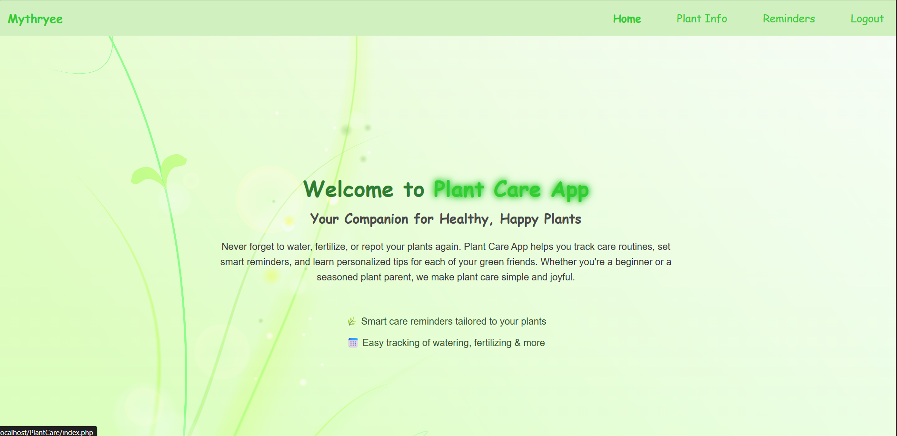
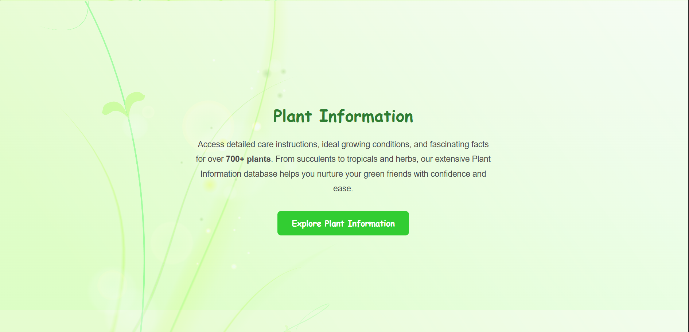
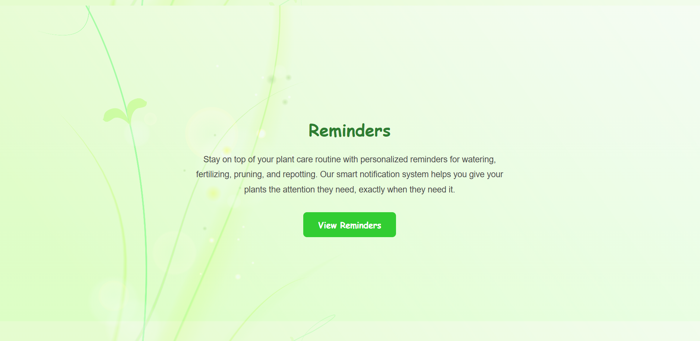
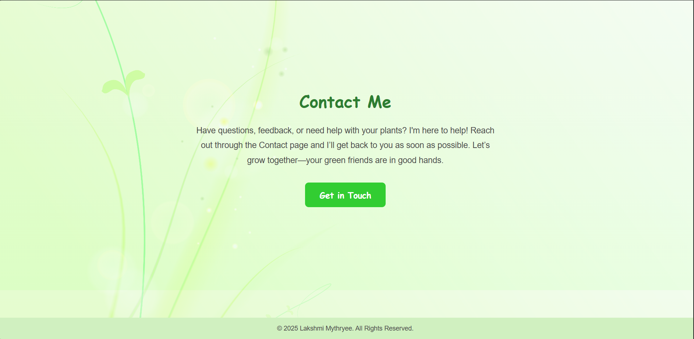
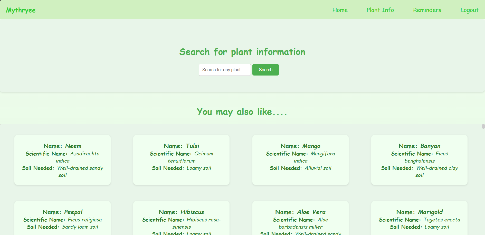
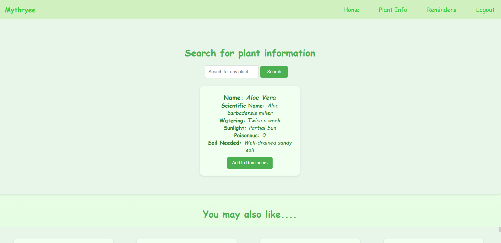
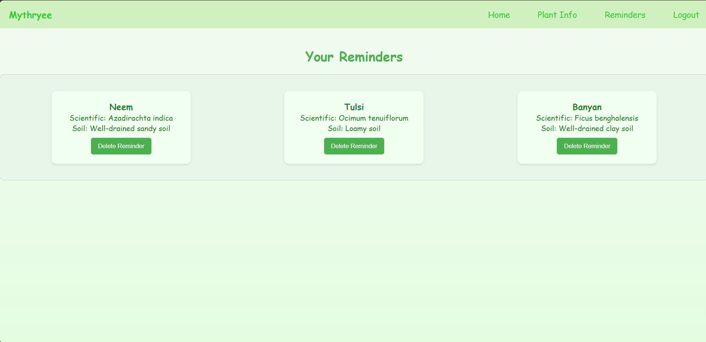
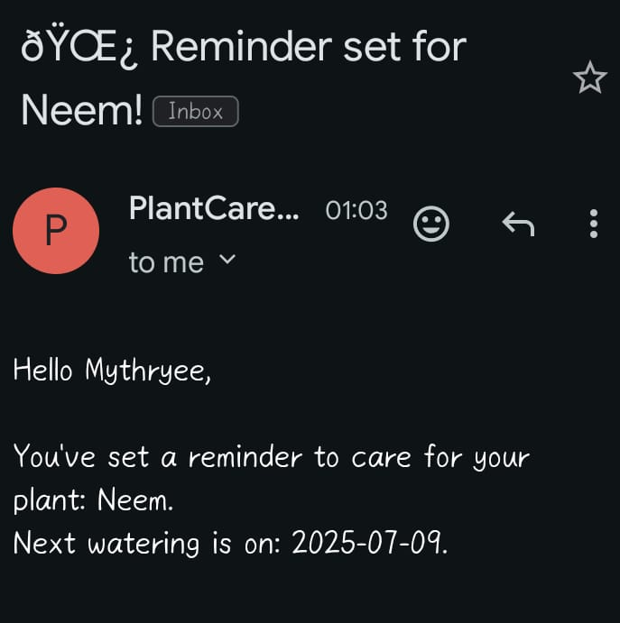

# 🌱 Plant Care Reminder App

A full-stack web application to help users take care of their plants by providing plant information, setting reminders, and sending automated watering notifications via email.

---

## 🚀 Features

- ✅ **User Login & Registration**
- ✅ **Search for Plant Information**
- ✅ **Set Plant Care Reminders**
- ✅ **Automated Email Alerts (SMTP using PHPMailer)**
- ✅ **Responsive Design (Mobile-Friendly)**
- ✅ **PHP & MySQL Backend**

---

## 🖥️ Screenshots
# Home page

| Home | Plant Info | Reminders | Contact |
|----------|--------------|--------------|--------------------|
|  |  |  |  |

# Other pages

| Plant Info | Plant Info Search | Reminders |
|----------|--------------|--------------|
|  |  |  |

---
## 📸 Mail
|  |

---

## 🛠️ Tech Stack

| Category         | Technologies Used                                |
|------------------|--------------------------------------------------|
| **Frontend**     | HTML5, CSS3, JavaScript                          |
| **Backend**      | PHP, MySQL                                        |
| **Email System** | PHPMailer (SMTP with Gmail)                       |
| **Design**       | Figma                                             |
| **Version Control** | Git & GitHub                                   |

---

## 🗄️ Database Structure

```sql
CREATE DATABASE plantcare;

CREATE TABLE userdetails (
  user_id INT AUTO_INCREMENT PRIMARY KEY,
  user_name VARCHAR(100) NOT NULL
  user_mail VARCHAR(100) NOT NULL,
  password VARCHAR(255) NOT NULL
);

CREATE TABLE plantdetails (
  id INT AUTO_INCREMENT PRIMARY KEY,
  common_plant VARCHAR(100),
  scientific_name VARCHAR(100),
  watering VARCHAR(50),
  sunlight VARCHAR(50),
  poisonous BOOLEAN,
  soil_needed VARCHAR(100)
);

CREATE TABLE reminders (
  user_id INT NOT NULL,
  plant_id INT NOT NULL,
  next_watering_date INT NOT NULL;
  FOREIGN KEY (user_id) REFERENCES userdetails(user_id),
  FOREIGN KEY (plant_id) REFERENCES plantdetails(id)
);


```
## 📧 Email Reminder Setup (SMTP)

1. Enable **2-Step Verification** on your Gmail account.
2. Generate an **App Password** under **Google Account > Security > App Passwords**.
3. Use this App Password in your PHPMailer configuration:

```php
$mail->Username = 'your_email@gmail.com';
$mail->Password = 'your_app_password';
📩 Emails are sent immediately when a user adds a reminder.

✅ To send periodic watering reminders (daily, weekly, etc.), create a separate send_reminders.php script and schedule it using cron jobs on your server.

🗂 Folder Structure
plaintext
Copy
Edit
PlantCare/
├── Components/
│   └── navbar.php/
├── phpmailer/
│   └── src/
├── images/
├── style.css
├── index.php
├── plantinfo.php
├── reminders.php
├── login.php
├── logout.php
├── signup.php
└── 699.jpg

```
# 📌 How to Run
- Clone this repo: https://github.com/yourusername/PlantCare.git
- Import the SQL database into phpMyAdmin or MySQL.
- Update PHPMailer SMTP settings in plantinfo.php and future send_reminders.php file.
- Run the project using XAMPP, MAMP, or any local PHP server.
---
# 💡 Future Improvements

- ⏰ Fully automated watering emails using scheduled cron jobs.

- 📱 Mobile-first UI enhancements for better responsiveness.

- 🔒 Stronger authentication and security features.
---
# 🤝 Contributing
- Pull requests and ⭐ stars are welcome!

- If you have any suggestions, feel free to open an issue or submit a pull request.
